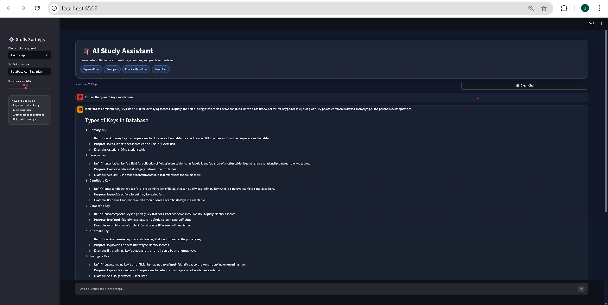

# 🎓 AI Study Assistant

An AI-powered chatbot designed to help students learn faster through explanations, examples, and practice questions.

## 🚀 Features

- 📚 Multiple learning modes (General Learning, Exam Prep, Simple Explanation, Quiz)
- 🤖 AI-powered responses using OpenAI API
- 💬 Interactive chat interface
- 🎯 Helps understand complex concepts easily
- 🎨 Clean and modern UI built with Streamlit


## 🛠️ Tech Stack

- Python
- Streamlit
- OpenAI API


## 📸 Screenshot




## 📌 Description

This project is an AI-powered study assistant built using Streamlit and the OpenAI API. It helps students understand academic concepts through structured explanations, real-world examples, and practice questions.

The application supports multiple learning modes such as exam preparation and quiz-based learning, making it a flexible tool for different study needs.

This project demonstrates practical experience in AI integration, interactive UI development, and building real-world educational tools.


## ⚙️ How to Run

1. Clone the repository

```bash
git clone https://github.com/Jasmine588/AI-Study-Assistant.git
cd AI-Study-Assistant
```

2. Install dependencies
```bash
pip install -r requirements.txt
```

3. Run the application
```bash
streamlit run AIChatbot.py
```

### 🔐 API Key Setup

This project requires an OpenAI API key.

You can either:

* Enter your API key directly in the app when prompted
  OR
*Store it locally using Streamlit secrets:

1. Create a file:
```bash

.streamlit/secrets.toml
```

2. Add:
```bash
OPENAI_API_KEY = "your-api-key-here"
```

## 📂 Project Structure
```bash
AI-Study-Assistant
│
├── AIChatbot.py
├── requirements.txt
├── screenshot.png
└── README.md
```

## 🧠 Skills Demonstrated

* AI API integration
* Prompt engineering
* Interactive UI development
* State management (chat history)
* User-focused application design
